# УП.02. Тема: «Тренажёр неправильных глаголов английского языка»

## 1. Актуальность темы

Неправильные глаголы английского языка представляют собой одну из ключевых сложностей при изучении грамматики, поскольку они не образуют формы прошедшего времени (Past Simple) и причастия прошедшего времени (Past Participle) по стандартному правилу (добавление окончания **-ed**). Без уверенного знания трёх форм глаголов невозможно свободное владение языком на уровнях A2 и выше.

Существующие аналоги (мобильные приложения, веб-сайты) часто содержат навязчивую рекламу, ограниченный бесплатный функционал или не предоставляют системы отслеживания прогресса пользователя. Данный проект предлагает простое, но функциональное решение с возможностью регистрации, ведения личного рекорда и сохранения результатов тренировок.

> **Актуальность** также подтверждается тем, что тема неправильных глаголов входит в обязательную программу школьного курса английского языка (5–11 классы) и вызывает трудности у большинства учащихся.

## 2. Целевая аудитория

- **Школьники 5–11 классов** – подготовка к урокам, контрольным работам, ОГЭ и ЕГЭ.
- **Студенты языковых и неязыковых специальностей** – повторение и закрепление материала.
- **Взрослые, самостоятельно изучающие английский язык** – удобный инструмент для самопроверки.
- **Преподаватели английского языка** – возможность рекомендовать тренажёр ученикам в качестве дополнительного материала.

## 3. Предполагаемые функциональные возможности

### Для всех пользователей (без авторизации):
- Просмотр полной таблицы неправильных глаголов (80+ глаголов) с переводом на русский язык.
- Поиск по таблице (по инфинитиву или переводу).
- Фильтрация глаголов по первой букве.
- Режим тренировки: случайный выбор вопросов, ввод двух форм глагола (Past Simple и Past Participle).
- Мгновенная проверка ответов с подсчётом правильных ответов и текущей серии успехов.

### Для авторизованных пользователей:
- Регистрация и вход в личный кабинет.
- Сохранение личного рекорда (максимальное количество правильных ответов подряд).
- Отображение прогресса и статистики в личном кабинете.
- Автоматическое обновление рекорда при его улучшении.

## 4. Используемые технологии (предварительно)

| Компонент | Технология | Назначение |
|-----------|------------|------------|
| **Frontend** | HTML5, CSS3, JavaScript (ES6) | Структура, стилизация и логика приложения |
| **Стилизация** | CSS3 (Flexbox, Grid, медиазапросы) | Адаптивный дизайн, поддержка мобильных устройств |
| **Хранение данных** | LocalStorage (для учебной версии) | Сохранение пользователей и рекордов |
| **СУБД (для УП.11)** | SQLite / MySQL | Проектирование базы данных, SQL-запросы |
| **Инструменты** | VS Code, Figma (прототипирование) | Разработка и макетирование |

## 5. Ожидаемый результат

В результате выполнения проекта по учебной практике будет создано **полностью рабочее веб-приложение**, состоящее из трёх основных страниц:

1. **Страница изучения** – таблица всех неправильных глаголов с поиском и фильтрацией.
2. **Страница тренировки** – интерактивный режим проверки знаний с подсчётом серии правильных ответов.
3. **Личный кабинет** – регистрация, вход, отображение личного рекорда.

### Ключевые характеристики результата:
- Интуитивно понятный и современный интерфейс.
- Адаптивная вёрстка (корректное отображение на ПК, планшетах и смартфонах).
- Сохранение данных пользователей в браузере (LocalStorage).
- Возможность масштабирования до полноценного серверного решения.

## Use-case диаграмма
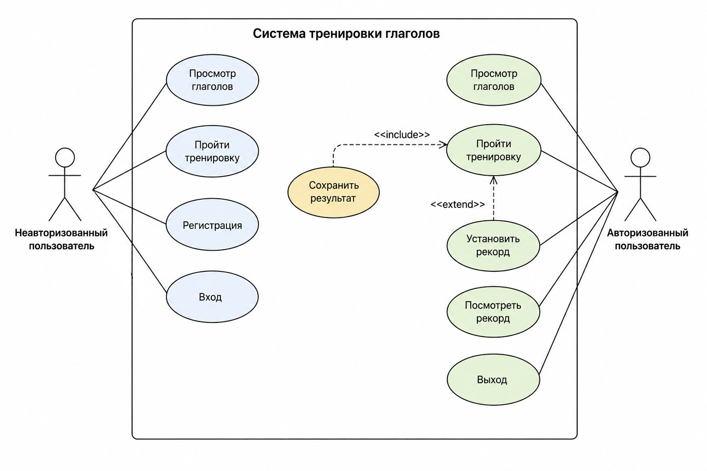

## Макет веб-приложения
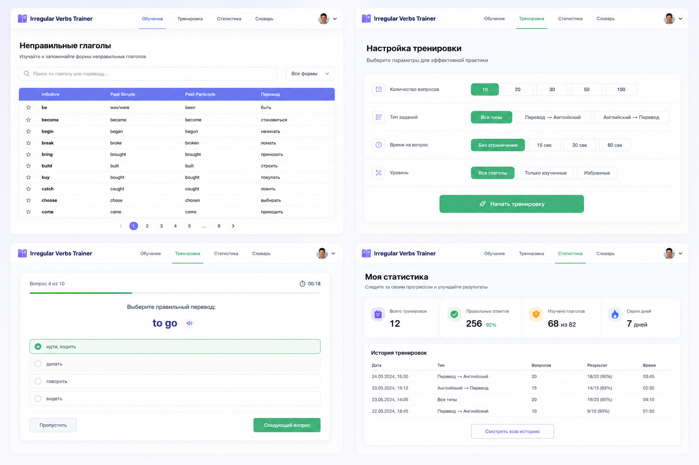

## Реализованные HTML-страницы
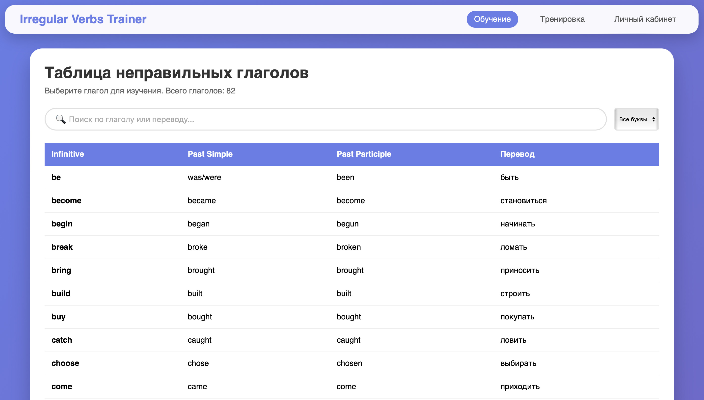
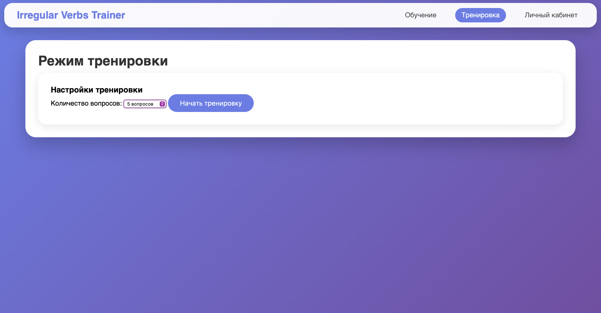
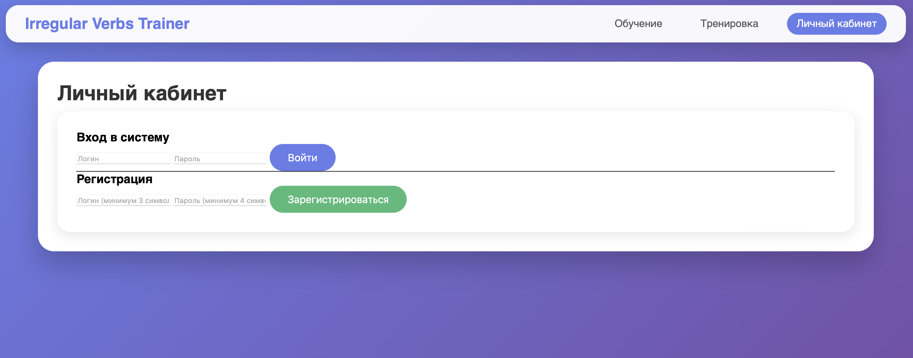

# УП.11 Тема: «Тренажёр неправильных глаголов английского языка»

## ER-диаграмма
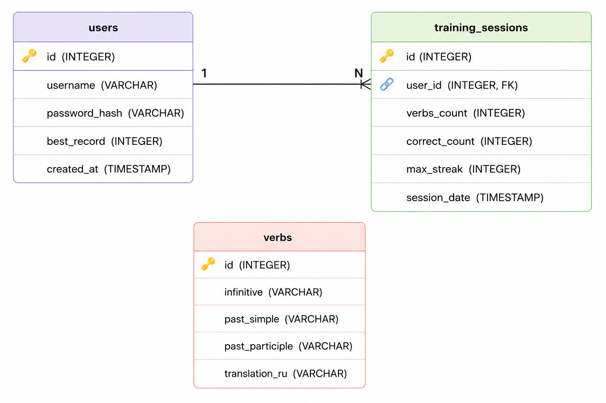

## Скриншоты выполнения SQL-запросов
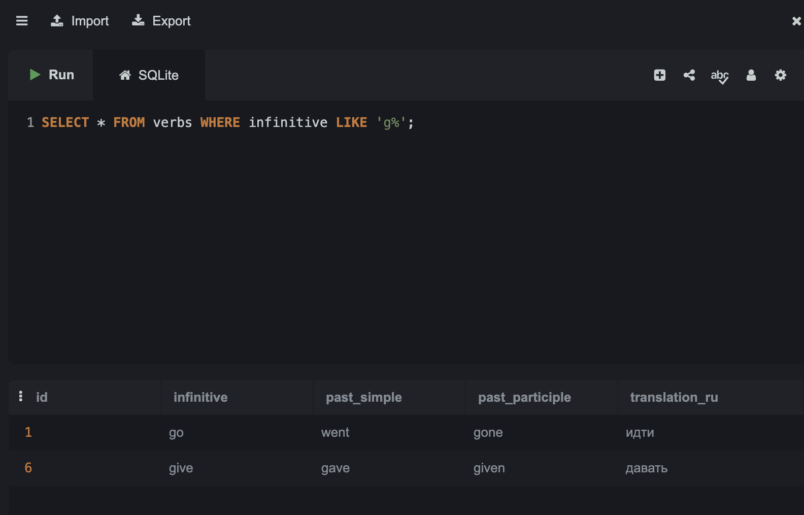
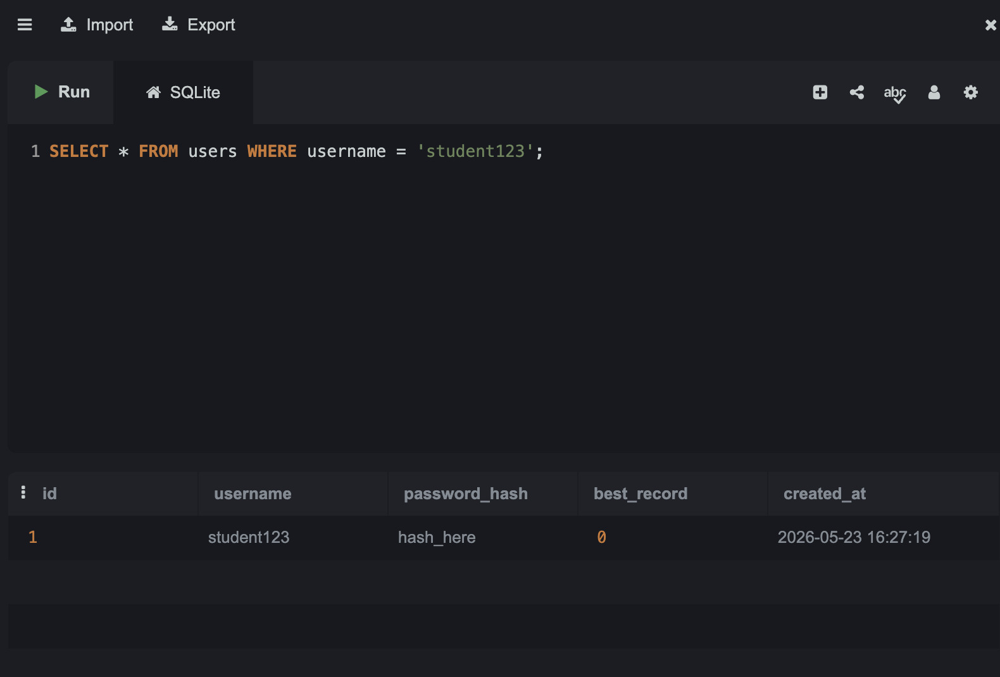
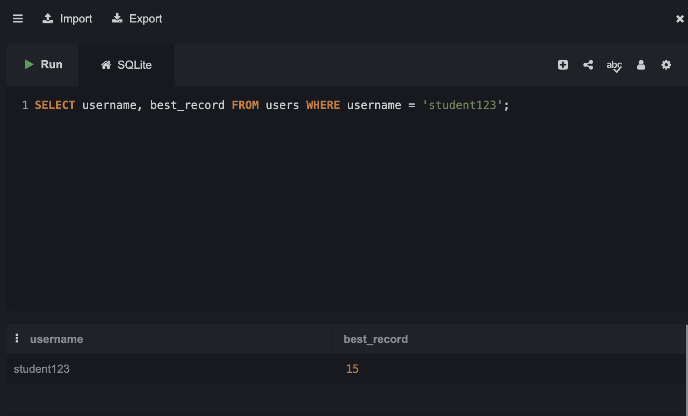
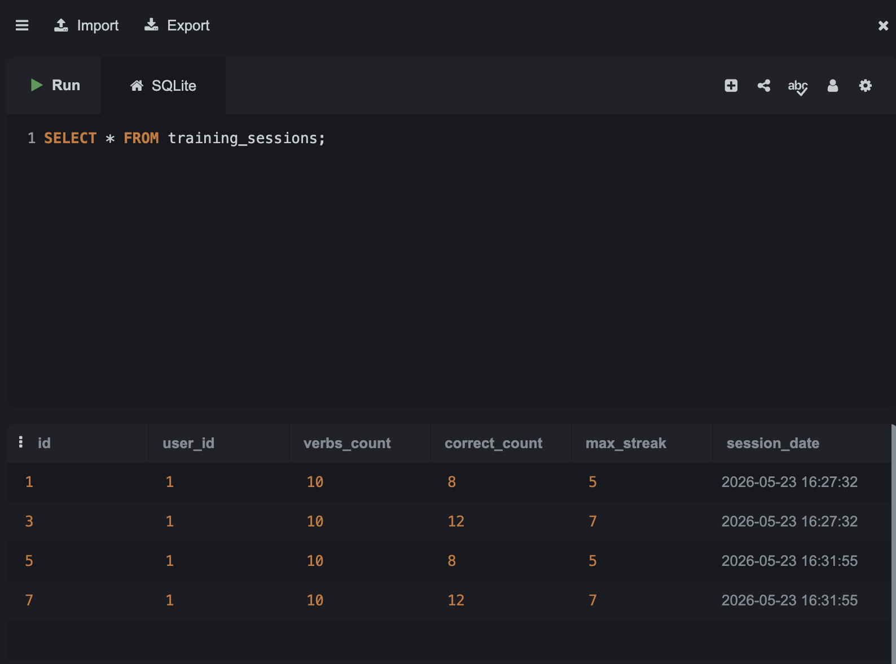
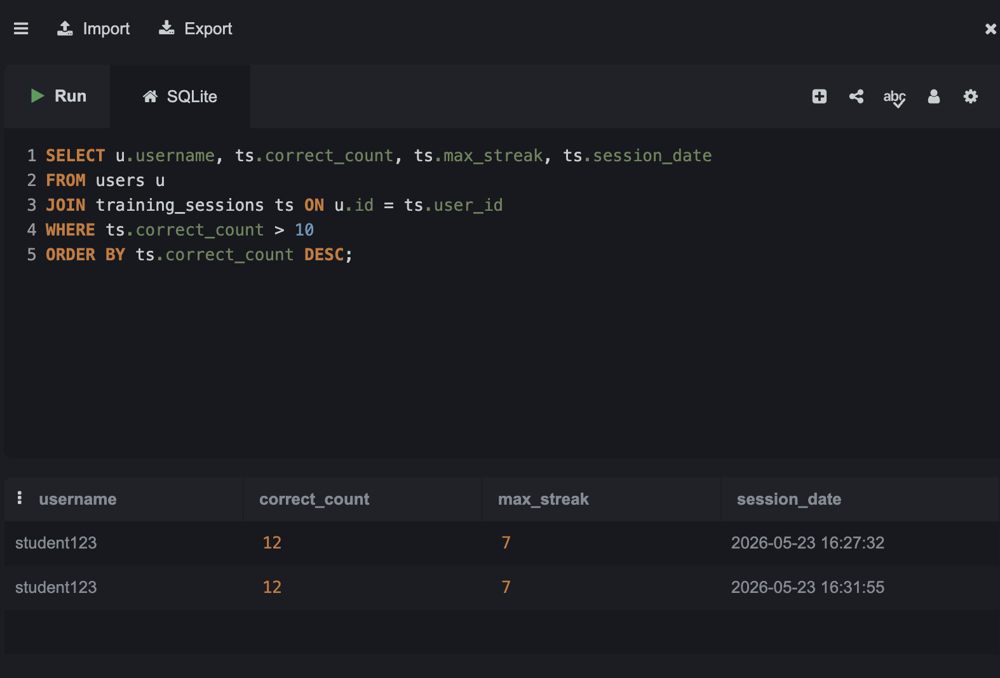

